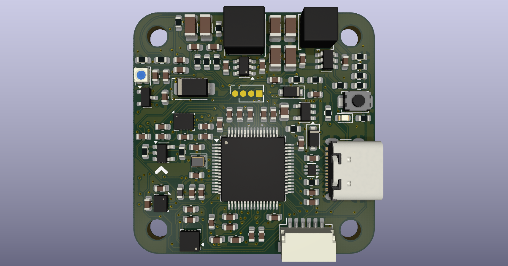
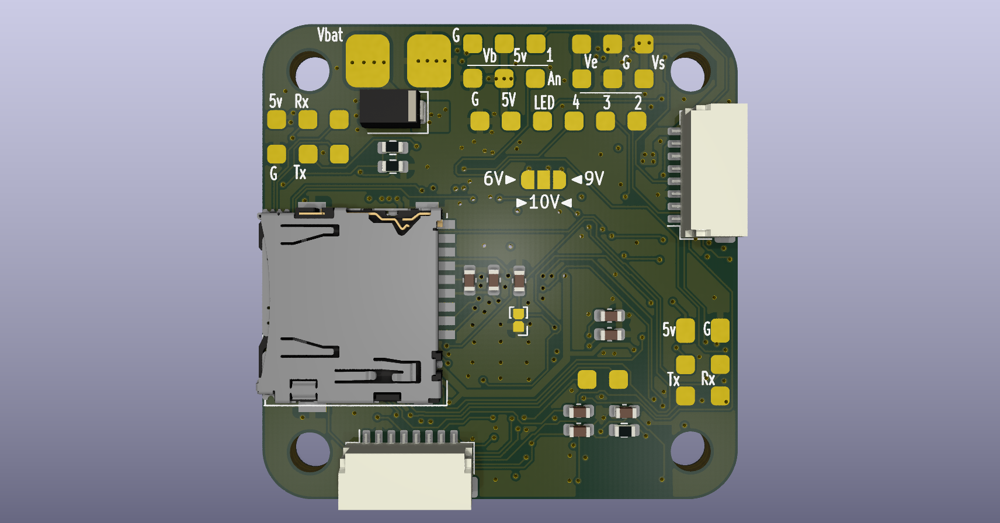

# STM32H5 General Autopilot

A high-performance, compact autopilot utilizing the modern STM32H5 architecture.

 

## Features

* **Power Input:** 2S - 6S LiPo compatible
* **Dual BEC System:** 
    * `5V @ 2A` (Fixed)
    * `5V / 6V / 9V / 10V @ 2A` (Selectable)
* **Onboard Sensors:**
  * **IMU:** BMI270 or ICM-42688-P
  * **Barometer:** BMP280
  * **Compass:** QMC5883L
* **Connectivity:**
  * 6x UARTs
  * 1x I2C
  * MicroSD Card Slot
* **Signaling & Peripherals:**
  * WS2812B Addressable LED Strip Output
  * **7x Configurable GPIOs:**
    * 1x Analog Input
    * 2x Extra ESC Outputs (bringing total potential ESC outputs to 6)
    * 1x Timer Output
    * 3x Regular GPIOs
* Onboard monitoring of battery voltage and current, servo and 5V rail voltage.

